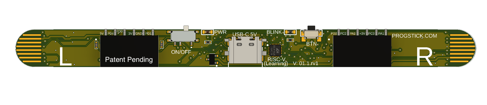

# Progstick
## Model board progsticks  0.1.rv1 v73


- 32-bit RISC-V architecture
- Clock speed up to 48 MHz.
- 20KB flash memory for code.
- 4KB SRAM.
- 23 GPIO pins.
- 10-bit ADC
- Analog comparators
- PWM
- UARTs
- SPI
- I2C
- Timers
- Watchdog timer
- Support for low power and sleep modes.

# Installation

## Prerequisites

### Cargo
Cargo is the package manager for the Rust programming language. It is included by default when you install Rust.

Installing Cargo and Rust

To install the Rust package manager (Cargo), follow the instructions for your operating system:

-- Linux and MacOS
```
curl --proto '=https' --tlsv1.2 -sSf https://sh.rustup.rs | sh
```
Closed and open 
Check if the installation worked:
```
cargo --version
```


-- Windows  

1. Download the installer at https://www.rust-lang.org/tools/install and run it.

2. Open the command prompt and check the installation with:
```
cargo --version
```

3. If it does not work, manually configure the environment variables:
```
CARGO_HOME=%USERPROFILE%.cargo
PATH=%CARGO_HOME%\bin
```

4. Try checking the installation again with `cargo --version`.

If you have any issues installing, open a ticket with the error.

### - Hardware
WCHLink-E (Only work with WCHLink-E, no WCHLink).
[Buy in Aliexpress](https://www.aliexpress.us/w/wholesale-WCHLink%2525252dE.html)

## Install wlink - WCH-Link(RV)
```
cargo install --git https://github.com/ch32-rs/wlink
```
or download a binary from the [Nightly Release page](https://github.com/ch32-rs/wlink/releases/tag/nightly).

> **Note**
> On Linux, you should install libudev and libusb development lib first.
> Like `sudo apt install libudev-dev libusb-1.0-0-dev` on Ubuntu.

## Usage
```
wlink flash --address 0x08000000 firmware.bin
```
> **Note**
> The firmware.bin file must be in the same directory where the command is executed.

```console
> wlink flash --address 0x08000000 firmware.bin
12:10:26 [INFO] WCH-Link v2.10 (WCH-Link-CH32v003)
12:10:26 [INFO] Attached chip: CH32v003(0x30700518)
12:10:26 [INFO] Flashing 8068 bytes to 0x08000000
12:10:27 [INFO] Flash done
12:10:28 [INFO] Now reset...
12:10:28 [INFO] Resume executing...
```
